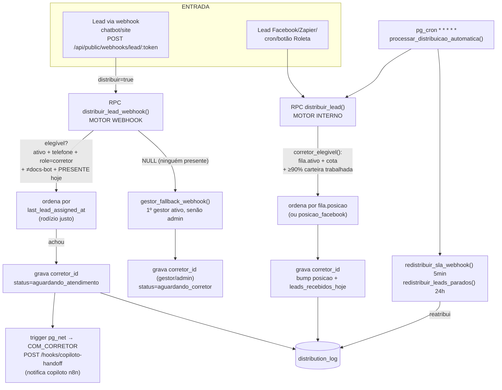

# Auditoria + Proposta — Distribuição de Leads (SMQ CRM)

> **Tipo:** auditoria + proposta. **Nada foi aplicado** — nenhuma escrita em banco,
> Lovable ou automações. Todo trecho de código proposto está em bloco, para revisão.
> **Data:** 2026-07-05. **Branch:** `claude/lead-distribution-audit-dkxyia`.

---

## Sumário executivo

**Correções de premissa (o prompt de auditoria descreve outra arquitetura).**
Este repositório **é o código-fonte do CRM Lovable em si** — não o vault de docs
`SMQ-Operacao`. Não existem aqui os arquivos citados no prompt
(`PROMPT-LOVABLE-*.md`, `fluxo-*.md`, `MAPA-DE-ROTAS`, `server.py`, backups n8n,
SOP Obsidian), nem a tabela `distribuicoes` com coluna `metodo`, nem a regra
`projeto → região → round-robin`. A distribuição real:

- roda em **RPCs Postgres + rotas TanStack Start + telas React** deste repo;
- **está AO VIVO e ESCREVE no banco** — não há "dry-run" nem "sombra". O motor
  interno e a realocação por SLA rodam via `pg_cron` **a cada minuto**;
- é feita por **dois motores distintos** (não um) + um realocador de SLA;
- loga em **`distribution_log`** (não `distribuicoes`); região/projeto **não**
  entram na escolha do corretor.

**Causa-raiz nº 1 ("marcar ativo não muda nada"): há três flags de on/off
independentes, escritas por três telas diferentes e lidas por motores diferentes.**
O gestor liga/desliga uma flag que o motor daquele lead nem lê — e a porta que
realmente decide no webhook (`presente`) não é editável por nenhuma tela de gestão.

**Diagnóstico dos 7 sintomas (detalhe na §2):**

| # | Sintoma | Veredito |
|---|---|---|
| 1 | Marcar ativo/inativo não muda quem recebe | **Confirmado** — 3 flags divergentes |
| 2 | `presente` (plantão) é ignorado | **Confirmado (parcial)** — ignorado no motor interno; respeitado no webhook |
| 3 | Conta não-corretor (admin/gestor) recebe lead | **Confirmado (por design)** — `gestor_fallback_webhook`; `docs-bot` já é excluído |
| 4 | `limite_diario_leads` não é respeitado | **Confirmado (parcial)** — motor interno usa `fila.max_leads_dia`; webhook não tem cota; `profiles.limite_diario_leads` é coluna morta |
| 5 | Ordem opaca | **Confirmado** — dois cursores distintos, nenhum exposto de forma clara |
| 6 | Muito lead órfão | **Confirmado** — bug histórico "120→0" (já mitigado) + `aguardando_corretor` fora do enum TS + roleta que só roda com alguém presente |
| 7 | Três regras divergentes | **Confirmado** — webhook (presença+rodízio) ≠ interno (90%+cota) ≠ SLA (tempo) |

**Proposta:** uma **política única por performance** — para cada *tipo* de lead,
escolher entre os **elegíveis** quem tem maior **conversão histórica naquele tipo**,
com **menor tempo de 1ª resposta (TTFR)** como desempate; com guardrails de
cold-start (ε/Wilson), anti-starvation, teto diário e fallback para o rodízio justo
atual. Boa parte da instrumentação **já existe** (`tempo_primeira_resposta`,
`rel_conversao_por_corretor`, `distribution_log`) — falta segmentar por *tipo* e
unificar a elegibilidade. Rollout em portões (Fase 0 instrumentar → 1 dry-run →
2 sombra → 3 canário → 4 produção), **construindo primeiro** a camada de dry-run
que hoje não existe.

**Status da validação ao vivo:** as consultas de leitura (Supabase/CRM MCP) foram
**bloqueadas por falha de aprovação da ferramenta MCP** nesta sessão. As queries
prontas para rodar estão no **Apêndice A** — cada sintoma tem o SELECT exato para
confirmar os números reais assim que a ferramenta for liberada.

---

## 0. Escopo, método e fontes

- **Método:** leitura de código com citação `arquivo:linha` (migrations SQL, rotas
  da API pública, telas React) + validação por leitura ao vivo (pendente — Apêndice A).
- **Fonte de verdade do contrato:** como os specs Lovable não existem no repo, a
  **implementação** (SQL + rotas) É o contrato. Onde o prompt divergiu do código,
  o código prevalece e a divergência foi anotada.
- **Objetos reais** (inventário completo no Apêndice B): tabelas `profiles`,
  `user_roles`, `fila_distribuicao`, `leads`, `distribution_log`, `distribuicao_config`,
  `interacoes`, `lead_status_transitions`, `projetos`; RPCs `distribuir_lead_webhook`,
  `gestor_fallback_webhook`, `distribuir_lead`, `corretor_elegivel`,
  `processar_distribuicao_automatica`, `redistribuir_sla_webhook`,
  `redistribuir_leads_parados`, `tempo_primeira_resposta`, `rel_conversao_por_corretor`,
  `dashboard_metricas_por_corretor`, `produtividade_corretores`.

---

## 1. Mapa da distribuição atual



### 1.1 Tabela-mapa (o que lê / como decide / o que escreve / estado)

| Peça | Onde vive | O que LÊ / como decide | Escreve? | Estado |
|---|---|---|---|---|
| **Motor Webhook** | `distribuir_lead_webhook()` — `supabase/migrations/20260704210000_webhook_roleta_presenca.sql:24-57`; chamada em `src/routes/api/public/webhooks/lead/$token.ts:178-189` | `profiles.ativo=true` **E** `telefone≠''` **E** `user_roles.role='corretor'` **E** `nome≠docs-bot` **E** `presente=true` no dia (America/Sao_Paulo). Ordena por `last_lead_assigned_at NULLS FIRST`. **Sem** cota/90%. | **SIM** (`corretor_id`, `last_lead_assigned_at`) | **LIVE** |
| **Fallback gestor** | `gestor_fallback_webhook()` — `20260704165052_...:44-59`; `$token.ts:182-188` | 1º `gestor` ativo (≠docs-bot); senão 1º `admin` ativo. Ordena por `(role=gestor) DESC, created_at ASC`. | **SIM** (`corretor_id` = gestor/admin, `status=aguardando_corretor`) | **LIVE** |
| **Motor Interno** | `distribuir_lead()` + `corretor_elegivel()` — `20260702120000_distribuicao_produtividade_90.sql:22-148` | `fila_distribuicao.ativo=true` **E** `leads_recebidos_hoje < max_leads_dia` **E** `≥90%` da carteira ativa fora de `aguardando_atendimento`. Ordena por `posicao` (Facebook: `COALESCE(posicao_facebook, posicao)`). **Sem** presença. | **SIM** (`corretor_id`, bump `posicao`/`leads_recebidos_hoje`, `distribution_log`) | **LIVE** |
| **Cron drenador** | `processar_distribuicao_automatica()` — `20260702120000_...:167-198`; agendado `* * * * *` em `20260705100000_intake_sla_webhook.sql` | Pega `corretor_id IS NULL` em `('novo','aguardando_atendimento')`, FIFO por `created_at`, lote 200; chama `distribuir_lead_elegivel`. | **SIM** (via `distribuir_lead`) | **LIVE** |
| **Realocador SLA (min)** | `redistribuir_sla_webhook()` — `20260705100000_...:193-273` | Lead `via_webhook` em `aguardando_atendimento` além de `distribuicao_config.timeout_minutos` (default **5 min**) desde `data_distribuicao`; reusa a roleta de presença; `≤3` repasses; nunca repete corretor. | **SIM** (`corretor_id`, `distribution_log tipo='redistribuicao'`) | **LIVE** |
| **Realocador parados (h)** | `redistribuir_leads_parados()` — `20260705100000_...:84-174` | Lead parado além de `timeout_horas` (default **24h**); caps **10/corretor**, **50/rodada**; `≤3` tentativas; move só se houver destino elegível. | **SIM** | **LIVE** |
| **Handoff copiloto** | `src/routes/api/public/hooks/copiloto-handoff.ts` (trigger `pg_net` em estado `COM_CORRETOR`) | Só **notifica** o copiloto (n8n `.../webhook/copiloto/handoff`). Não decide corretor. | Notifica (não distribui) | LIVE |

### 1.2 Contrato do webhook (não pode quebrar)

Resposta de sucesso (`$token.ts:326-338`):

```json
{ "ok": true, "projeto": "...", "lead_id": "...", "corretor_id": "...|null",
  "corretor_nome": "...", "corretor_telefone": "55DDDNUMERO", "corretor_email": "...",
  "distributed": true, "motivo": null }
```

- **Campos sagrados** (dependência da automação): `ok, lead_id, corretor_id,
  distributed, motivo`. Os `corretor_*` foram adicionados por cima (`:270`
  "*formato preservado*").
- `distributed = !assignedToFallback` e vira `false` se o corretor não tem telefone
  (`$token.ts:284-296`).
- `motivo ∈ {null, "sem_corretor_disponivel_fallback_gestor",
  "sem_corretor_disponivel", "corretor_sem_telefone"}` (`:185-187, :287`).
- **Resposta de duplicado tem outro shape** (`$token.ts` dedup): `{ ok, duplicate:true,
  projeto, lead_id }` — sem `corretor_*`/`distributed`/`motivo`. Integradores precisam
  tratar `duplicate`.

---

## 2. Diagnóstico dos sintomas (evidência de código + como validar ao vivo)

### Sintoma 1 — "marcar ativo/inativo não muda nada" → **CONFIRMADO (causa-raiz)**

Existem **três flags de on/off independentes**, escritas por **três telas** e lidas
por **motores diferentes**:

| Flag (coluna) | Significado | Tela que escreve | Motor que lê |
|---|---|---|---|
| `profiles.ativo` | conta bloqueada/ativa (cadastro) | `corretores.tsx:118` → `supabase.from("profiles").update({ ativo })` (botão Bloquear/Reativar) | **só Motor Webhook** (`20260704210000:37`) |
| `fila_distribuicao.ativo` | participa da fila do motor interno | `distribuicao.tsx:165` → `supabase.from("fila_distribuicao").update(patch)` (switch "Ativo") | **só Motor Interno** (`20260702120000:33,93,102`) |
| `profiles.presente` + `presente_em` | plantão do dia ("Cheguei") | `meu-perfil.tsx` → RPC `marcar_presenca` | **só Motor Webhook** (`20260704210000:42-45`) |

**Por que o botão parece não fazer nada:**
1. O toggle da tela **Corretores** grava `profiles.ativo` — que **só** o Motor
   Webhook lê. Se o lead em questão veio pelo motor **interno** (Facebook/cron),
   `profiles.ativo` é irrelevante.
2. O switch "Ativo" da tela **Distribuição** grava `fila_distribuicao.ativo` — que
   **só** o Motor Interno lê. Não afeta o webhook.
3. A porta que **de fato** decide no webhook (`presente`) **não é editável** por
   nenhuma tela de gestão — só o próprio corretor liga/desliga via "Cheguei"
   (`meu-perfil.tsx`).
4. Somado a isso, como (conforme o prompt) **os 22 cadastros estão `ativo=true`**,
   o gate de conta não exclui ninguém — no webhook a única porta efetiva é `presente`.

**Onde corrigir:** unificar o conceito. Ver §4(b) — um controle de "disponível para
receber" que reflita na coluna certa (ou uma view/função única de elegibilidade que
ambos os motores consultem) e permitir o gestor gerir presença/plantão.

**Validar ao vivo:** Apêndice A.1 (`count(*) filter (ativo)` em `profiles`) e A.2
(presença × recebidos).

---

### Sintoma 2 — "`presente` é ignorado pela roleta" → **CONFIRMADO (parcial)**

- **Motor Interno ignora `presente` de propósito** (`20260702120000:4-8`): *"corretor_elegivel
  … DEIXA DE exigir presença marcada no dia — a trava de 'Cheguei' fazia o motor
  automático não distribuir nada quando ninguém marcava presença."*
- **Motor Webhook respeita `presente`** (`20260704210000:42-45`).
- Portanto, **"Andrew `presente=false` com 121 leads"** é coerente: esses leads vieram
  pelo **motor interno** (que não olha presença), por **atribuição histórica** (antes
  da migração de presença, 04/07) ou por **realocação**. E **"luiz `presente=true`
  com 0"** é coerente: se luiz não está na `fila_distribuicao` (ou está atrás na
  `posicao`), o motor interno não o alcança; e o webhook depende do volume de leads
  de chatbot e da ordem `last_lead_assigned_at`.

**Onde corrigir:** na política única, tornar `presente` parte da **elegibilidade
comum** aos dois motores (ou um bônus configurável — ver perguntas abertas §7).

**Validar ao vivo:** Apêndice A.2.

---

### Sintoma 3 — "conta não-corretor recebe lead" → **CONFIRMADO (por design)**

`gestor_fallback_webhook()` (`20260704165052:44-59`) atribui, quando **ninguém está
presente**, ao **primeiro `gestor` ativo, senão `admin` ativo** — com status
`aguardando_corretor`. É a conta "Seu Metro Quadrado" (admin) aparecendo com lead.

- **`docs-bot` já é excluído** de todas as roletas e do fallback
  (`lower(nome) <> 'docs-bot'`), então o bot **não** recebe. Se o prompt viu
  "docs-bot" com lead, é atribuição antiga (antes da exclusão) — validar A.3.
- **Motor Interno não revalida `role`**: confia na participação em
  `fila_distribuicao`. Se um admin/gestor foi adicionado à fila, ele recebe.

**Onde corrigir:** manter o fallback (é rede de segurança), mas (i) marcar o lead do
fallback de forma inequívoca e alertável, (ii) garantir `role='corretor'` também no
motor interno, (iii) alinhar `aguardando_corretor` no enum TS (ver Sintoma 6).

**Validar ao vivo:** Apêndice A.3.

---

### Sintoma 4 — "`limite_diario_leads` não é respeitado" → **CONFIRMADO (parcial)**

- **Motor Interno respeita cota** — mas a de `fila_distribuicao.max_leads_dia`
  (default 10), não a de `profiles` (`20260702120000:33,94,103`).
- **Motor Webhook não aplica cota nenhuma** (`20260704210000:6-7`).
- **`profiles.limite_diario_leads` (default 50) e `profiles.limite_diario_webhook`
  (default 10) são colunas mortas**: nenhuma função/consulta as lê (só aparecem na
  definição `20260615195744:19-20` e em `types.ts`). O cap real é
  `fila_distribuicao.max_leads_dia`, editado só pela UI (`distribuicao.tsx`).

**Onde corrigir:** decidir a **fonte única** do teto diário (recomendo consolidar em
`fila_distribuicao.max_leads_dia` e **aposentar** as colunas de `profiles`, ou
sincronizá-las por trigger) e aplicá-lo **também no webhook** dentro da elegibilidade
comum. Ver §7 (default do limite).

**Validar ao vivo:** Apêndice A.4.

---

### Sintoma 5 — "ordem opaca" → **CONFIRMADO**

Há **dois cursores de rodízio diferentes**, e a UI não expõe nenhum de forma clara:

- Webhook ordena por **`profiles.last_lead_assigned_at`** (`20260704210000:46`).
- Interno ordena por **`fila_distribuicao.posicao`** (`20260702120000:105`).
- A tela Distribuição (`distribuicao.tsx`) lista a fila por `posicao` (coluna "#"
  implícita) e mostra **`fila_distribuicao.ultima_distribuicao`** — **não**
  `last_lead_assigned_at`. Ou seja, a "ordem" mostrada não corresponde ao próximo
  da vez do webhook. Não há badge "próximo da vez" que reconcilie os dois.

**Onde corrigir:** §4(b) — expor um "próximo da vez" real (reconciliando os cursores)
e o feed `distribution_log` (o card "Últimas distribuições" já existe em
`distribuicao.tsx:382-425`; falta a leitura preditiva).

---

### Sintoma 6 — "muito lead órfão / sem corretor" → **CONFIRMADO**

Três mecanismos somam para o acúmulo de órfãos:

1. **Bug histórico "120 → 0"** (`20260704180000_redistribuicao_guarda_corpos.sql:4-8`):
   `redistribuir_leads_parados()` *"arrancava TODO lead parado há +24h … sem limite …
   a cada 5 min — carteiras de 120 leads zeravam de um dia para o outro"*. **Já
   mitigado** (caps 10/50, só move se houver destino), mas gerou um estoque de órfãos.
2. **`aguardando_corretor` fora do enum TS** (`src/lib/leads.ts:6-18`): o fallback
   grava esse status (`$token.ts:203`), mas o front não o conhece → esses leads
   aparecem como "sem corretor / travados" na UI, mesmo tendo `corretor_id` (o gestor).
3. **Webhook só distribui se houver alguém `presente`**: fora do plantão, tudo cai no
   fallback (gestor) e fica em `aguardando_corretor`. Se ninguém entra na fila do
   motor interno com cota/90%, o `novo` também não escoa.

**Onde corrigir:** (i) adicionar `aguardando_corretor` ao enum TS + rótulo/cor; (ii)
alerta de órfão (o `gerar_alertas_leads_parados` já roda, mas notifica em 5 dias —
`20260619123001:24`); (iii) a política única reduz órfão ao ampliar elegibilidade.

**Validar ao vivo:** Apêndice A.5 e A.6.

---

### Sintoma 7 — "três regras divergentes" → **CONFIRMADO**

| Fluxo | Elegibilidade | Ordenação | Presença? | Cota? | 90%? |
|---|---|---|---|---|---|
| Webhook | ativo + telefone + role + presente | `last_lead_assigned_at` | **Sim** | Não | Não |
| Interno | fila.ativo + cota + 90% | `posicao` | **Não** | **Sim** (fila) | **Sim** |
| SLA | reusa a do caminho | idem | idem | — | — |

Não há **uma** definição de "corretor elegível". A proposta (§3) unifica isso.

---

## 3. Proposta — política única de distribuição por performance

> Objetivo: **maximizar conversão e velocidade**. Para cada *tipo* de lead, mandar
> para quem mais converte aquele tipo; menor **TTFR** como desempate. Com guardrails
> para não virar "os ricos ficam mais ricos".

### 3.1 "Tipo de lead" (segmentação)

Colunas reais em `leads` utilizáveis (Apêndice B): `origem` (enum), `faixa_mcmv`
(texto livre → normalizar para F2/F3/F4/SBPE), `projeto_id`+`projeto_nome`,
`temperatura` (enum), `usa_fgts`, `renda_estimada`. **Não existem** `regiao` nem
`empreendimento` em `leads` — **região deriva** de `leads.projeto_id → projetos.regiao |
projetos.zona_smq`.

**Dimensão primária proposta:** `faixa_mcmv × região` (as duas com maior efeito
esperado sobre conversão em MCMV), com `origem` como dimensão secundária. Regra de
**amostra mínima por célula** (`N_min`, ver §3.4): se a célula não atinge `N_min`,
**colapsa** para uma dimensão mais grossa (faixa → região → global), evitando
segmentar tão fino que cada célula fique sem sinal. `[SUPOSIÇÃO]` `N_min` inicial =
30 leads *maduros* por célula (a validar com volume real — Apêndice A.7).

### 3.2 Conversão por corretor × tipo

Reusar o padrão já implementado (`rel_conversao_por_corretor` conta
`lead_status_transitions.para_status='contrato_fechado'`, `20260616095924:344-349`), mas:

- **Segmentar por tipo** (nova view `vw_conversao_corretor_tipo`).
- **Usar proxies intermediárias** porque `contrato_fechado` é raro/lento. Proposta de
  **índice de avanço de funil** (sinal antecipado), com pesos ilustrativos:

  | Marco (via `lead_status_transitions.para_status`) | Peso |
  |---|---|
  | `agendado` | 1 |
  | `visita_realizada` | 2 |
  | `analise_credito` | 3 |
  | `contrato_fechado` | 5 |

  `indice_avanco(corretor, tipo) = Σ pesos_dos_marcos_atingidos / recebidos` na coorte.
  O **north-star** continua sendo a conversão em `contrato_fechado`; o índice é o
  sinal antecipado enquanto a coorte amadurece.

- **Coorte com maturação:** taxa = convertidos/recebidos **por coorte de
  `data_distribuicao`**, comparando só coortes com maturidade equivalente (ex.: leads
  com ≥45 dias para `contrato_fechado`; ≥7 dias para `agendado`). Não comparar coorte
  imatura com madura.

```sql
-- PROPOSTA (não aplicar) — conversão por corretor × tipo, base em transições.
CREATE OR REPLACE VIEW public.vw_conversao_corretor_tipo AS
WITH base AS (
  SELECT l.id, l.corretor_id, l.data_distribuicao,
         COALESCE(NULLIF(btrim(l.faixa_mcmv),''),'sem_faixa') AS faixa,
         COALESCE(pj.regiao, pj.zona_smq, 'sem_regiao')       AS regiao,
         l.origem::text                                       AS origem
  FROM public.leads l
  LEFT JOIN public.projetos pj ON pj.id = l.projeto_id
  WHERE l.deleted_at IS NULL AND l.na_lixeira = false
    AND l.corretor_id IS NOT NULL AND l.data_distribuicao IS NOT NULL
),
marcos AS (
  SELECT t.lead_id,
         bool_or(t.para_status = 'agendado')         AS m_agendado,
         bool_or(t.para_status = 'visita_realizada') AS m_visita,
         bool_or(t.para_status = 'analise_credito')  AS m_credito,
         bool_or(t.para_status = 'contrato_fechado') AS m_fechado
  FROM public.lead_status_transitions t
  GROUP BY t.lead_id
)
SELECT b.corretor_id, b.faixa, b.regiao, b.origem,
       count(*)                                              AS recebidos,
       count(*) FILTER (WHERE m.m_fechado)                   AS fechados,
       round(100.0 * count(*) FILTER (WHERE m.m_fechado) / NULLIF(count(*),0), 2) AS conv_pct,
       round((
         1 * count(*) FILTER (WHERE m.m_agendado)
       + 2 * count(*) FILTER (WHERE m.m_visita)
       + 3 * count(*) FILTER (WHERE m.m_credito)
       + 5 * count(*) FILTER (WHERE m.m_fechado)
       )::numeric / NULLIF(count(*),0), 3)                   AS indice_avanco
FROM base b
LEFT JOIN marcos m ON m.lead_id = b.id
GROUP BY b.corretor_id, b.faixa, b.regiao, b.origem;
```

### 3.3 Tempo de 1ª resposta (TTFR)

**Já existe** `tempo_primeira_resposta(_di,_df,_corretor)`
(`20260629160000_tempo_primeira_resposta.sql`): mede da **criação do lead** até a
**1ª `interacoes.direcao='saida'`**, retornando média + mediana por corretor. Proposta:

- **Estender por tipo** (mesmo join `leads → projetos` da view acima) e reportar
  **mediana + p90** (o p90 pega a cauda de leads mal atendidos).
- **Baseline do relógio:** hoje é `leads.created_at`. Para roteamento, o mais correto
  é medir de **`data_distribuicao`** (quando o corretor recebeu) — o corretor não
  responde antes de receber. Recomendo **um TTFR do corretor a partir de
  `data_distribuicao`** para o score, mantendo o de `created_at` como KPI de entrada.
- **Cuidados:** só horário comercial/plantão; ignorar leads com opt-out
  (`estado='ENCERRADO_OPTOUT'`); leads sem nenhuma saída = "não respondido"
  (numerador do p90/percentual de não-resposta).
- **Uma definição, não duas:** o SLA hoje mede "sem atendimento" por **status**
  (`aguardando_atendimento` além de `data_distribuicao+timeout`, `20260705100000:211-217`),
  enquanto o TTFR mede por **interação de saída**. São conceitos diferentes ("mudou de
  etapa" vs "respondeu o cliente"). **Recomendo:** SLA de realocação continua por
  status (é o gatilho operacional); métrica de *performance* de velocidade usa a saída
  de `interacoes` (mais fiel). Documentar essa distinção para não medir duas coisas
  como se fossem uma.

### 3.4 Score de roteamento (com guardrails) — crítica e melhoria

Para um lead de tipo `T`:

1. **Elegíveis** (elegibilidade **única** para todos os caminhos):
   `role='corretor'` **E** `nome≠docs-bot` **E** `ativo=true` **E** `presente` hoje
   **E** `carga_hoje < limite_diario`. (Ver §4a: função `corretor_elegivel_unificado`.)
2. **Exploit (1−ε):** ordena por **conversão ajustada** desc. Para não premiar quem
   teve sorte com poucos leads, usar o **limite inferior de Wilson (95%)** da taxa de
   conversão (ou `indice_avanco` normalizado) em vez da taxa crua — quem tem amostra
   grande e boa taxa sobe; quem tem 1/1 não dispara pro topo.
3. **Desempate:** **TTFR mediano** (do corretor no tipo `T`) asc.
4. **Explore (ε):** com probabilidade **ε**, escolhe entre os elegíveis com **menos
   amostra em `T`** (cold-start), pelo rodízio justo (`last_lead_assigned_at`). Isso
   garante que corretor novo/sem histórico crie base — senão o modelo vira "viés de
   sobrevivência". Alternativa mais elegante: **Thompson sampling** sobre uma Beta por
   corretor×tipo (amostra a taxa, escolhe o argmax) — explora e explota sem ε fixo.
5. **Guardrails obrigatórios:**
   - **Anti-starvation:** nenhum elegível pode ficar zerado além de `G` leads do tipo
     `T` (gap máximo) — se estourar, entra forçado. `[SUPOSIÇÃO]` `G` inicial = 10.
   - **Teto diário:** respeita `limite_diario` (fonte única — §4c). Default se null:
     `[SUPOSIÇÃO]` 10 (o `max_leads_dia` atual).
   - **Fallback de cold-start do lead:** se `T` não tem histórico confiável (célula <
     `N_min` mesmo após colapsar dimensões), cai para o **rodízio justo atual**
     (`last_lead_assigned_at`). *(Obs.: o "projeto → região → round-robin" do prompt
     **não existe** no código; o fallback real e mais simples é o rodízio justo já em
     produção.)*
   - **SLA continua valendo:** se o escolhido não responde no prazo, o realocador
     (`redistribuir_sla_webhook`) reatribui — **sem mudança**.

**Crítica ao score do prompt:** ordenar por taxa crua desc é frágil com amostra
pequena (favorece ruído) e não explora (mata o cold-start). As melhorias acima
(Wilson/Thompson + ε + anti-starvation) resolvem isso mantendo a intenção de negócio.

### 3.5 Como os 3 fluxos passam a se encaixar (sem contradição)

- **Webhook (entrada, tempo real):** decide pelo **score por performance** entre os
  elegíveis presentes; sem ninguém elegível → fallback gestor (mantém).
- **Motor Interno (excedente/lote):** vira **equalizador** — distribui o que sobra e
  o que o cron drena, usando a **mesma elegibilidade** e o mesmo score, mas com o teto
  diário e a regra de produtividade como *limitadores de carga* (não como política
  separada).
- **SLA (correção):** inalterado — reatribui quem não respondeu, agora dentro da
  elegibilidade única.

Uma fonte de verdade de "elegível" + um score; três **gatilhos** (entrada, lote, SLA)
em vez de três **políticas**.

### 3.6 Exemplo numérico (ilustrativo — números reais pendentes de A.7)

Lead novo: `faixa_mcmv=F3`, `projeto → regiao='Zona Norte'`, `origem='chatbot'`,
`presente` agora. `ε=0,10`, `N_min=30`, sorteio caiu em **exploit**.

| Corretor | Elegível? | Recebidos F3/ZN | Conv% (crua) | Conv% (Wilson 95% inf.) | TTFR mediano (min) | Ordem |
|---|---|---|---|---|---|---|
| Ana | ✔ (presente, 4/10 hoje) | 84 | 21,4% | **17,9%** | 8 | **1º (escolhida)** |
| Bruno | ✔ (presente, 9/10 hoje) | 40 | 25,0% | 15,8% | 22 | 2º |
| Carla | ✔ (presente, 1/10 hoje) | 6 | 33,3% | 9,0% | 5 | 3º |
| Diego | ✘ (`presente=false`) | 120 | 28,0% | 22,1% | 6 | fora |
| docs-bot / admin | ✘ (role) | — | — | — | — | fora |

- **Carla** tem a maior taxa crua (33%) mas amostra minúscula (6) → Wilson derruba pra
  9%: não fura a fila só por sorte.
- **Diego** teria o melhor Wilson (22%), mas está **fora** por `presente=false`.
- **Ana** vence: melhor Wilson entre os presentes; se empatasse com Bruno, o TTFR
  (8 vs 22 min) decidiria por Ana.
- No próximo lead F3/ZN, o sorteio de **ε** pode mandar para **Carla** (cold-start),
  para ela criar amostra.

---

## 4. Onde cada mudança é feita (proposta — diffs pequenos e aditivos)

### (a) Patch de RPC/SQL (o "Lovable" real é este repo)

- **`corretor_elegivel_unificado(_corretor_id, _canal)`** — função única de
  elegibilidade que **ambos** os motores chamam (hoje divergem). Aditiva, ao lado das
  existentes.
- **`distribuir_lead_por_performance(_lead_id, _canal)`** — nova seleção por score;
  cai no rodízio justo quando o tipo é cold-start. **Não** substitui as funções atuais
  no dia 1 — coexiste para dry-run/canário (§5).
- **Views de métrica:** `vw_conversao_corretor_tipo` (§3.2) e extensão de
  `tempo_primeira_resposta` por tipo (§3.3).

### (b) UI React

- **Unificar "ativo":** um controle "Disponível para receber" que reflita na coluna
  certa (ou na elegibilidade única), e **permitir o gestor gerir presença/plantão**
  (hoje só o corretor marca "Cheguei").
- **"Próximo da vez" + ranking:** reconciliar `fila.posicao` vs
  `profiles.last_lead_assigned_at` num indicador único; expor o `distribution_log` de
  forma preditiva (o card retrospectivo já existe em `distribuicao.tsx:382-425`).
- **Alinhar enum:** adicionar `aguardando_corretor` a `LeadStatus`
  (`src/lib/leads.ts`) com rótulo/cor, para os leads de fallback pararem de parecer
  "sem corretor".

### (c) Schema / índices / views

- Views do item (a).
- Índices sugeridos: `interacoes(direcao, ocorreu_em)` (TTFR),
  `leads(corretor_id, status)` e `leads(data_distribuicao)` (coortes/SLA).
- **Teto diário:** decidir fonte única (consolidar em `fila_distribuicao.max_leads_dia`
  e aposentar `profiles.limite_diario_leads/limite_diario_webhook`, **ou** sincronizar
  por trigger). Ver §7.

### (d) Contrato do webhook — **preservado**

`ok, lead_id, corretor_id, distributed, motivo` **intactos** (`$token.ts:326-338`).
Novos campos só aditivos (ex.: `motivo_score`), nunca renomear/remover os existentes.

---

## 5. Plano de rollout (portões) — adaptado: hoje NÃO há dry-run

> Disciplina: o que hoje escreve **continua** como está até aprovação explícita de
> cada portão. A novidade (`distribuir_lead_por_performance`) **nasce sem escrever**.

- **Fase 0 — Instrumentar.** Criar `vw_conversao_corretor_tipo` + TTFR-por-tipo;
  publicar relatório e **validar contra o CRM** (Apêndice A). *Gate:* números batem com
  o painel.
- **Fase 1 — Dry-run (construir a camada que falta).** Para cada lead novo, **logar**
  "quem o modelo escolheria" vs "quem a roleta escolheu" numa tabela sombra
  (`distribuicao_shadow`), **sem** tocar `corretor_id`. *Gate:* cobertura ≥ X% dos
  leads logados; divergência analisada.
- **Fase 2 — Sombra.** Em coorte, estimar se o alvo do modelo converteria melhor /
  responderia mais rápido (contrafactual sobre o histórico + shadow). *Gate:* uplift
  estimado positivo e estável.
- **Fase 3 — Canário.** Ligar escrita para **10–20%** dos leads (ou um segmento), A/B
  vs controle, com **kill-switch** (flag que volta ao motor atual em 1 clique).
  *Gate:* conversão/TTFR do braço modelo ≥ controle; zero regressão de guardrails.
- **Fase 4 — Produção.** 100% + monitor + realocador SLA ativo. Motores antigos viram
  fallback.

---

## 6. Métricas de sucesso, baseline e A/B

**Baseline (medir ao vivo agora — Apêndice A):**

| Métrica | Fonte | Baseline | Meta |
|---|---|---|---|
| Conversão global (`contrato_fechado`/recebidos) | `dashboard_metricas_por_corretor` | _[A.8]_ | ↑ |
| TTFR mediano equipe | `tempo_primeira_resposta` | _[A.8]_ | ↓ |
| % leads não respondidos (sem saída) | `interacoes`/leads | _[A.8]_ | ↓ |
| Órfãos (`novo`/`aguardando_corretor` sem corretor útil) | `leads` | _[A.5/A.6]_ | ↓ |
| Leads para inativo/bot/admin | `distribution_log`×`user_roles` | _[A.3]_ | **0** |
| Respeito a presença + cota | derivado | _[A.2/A.4]_ | 100% |

**A/B (Fase 3):** randomização por lead; braço-modelo vs braço-controle; janela de
maturação para `contrato_fechado`; teste de significância na conversão e no TTFR p90.

---

## 7. Riscos e perguntas abertas (decisão do Guilherme)

1. **ε de exploração** (ou Thompson): quanto do fluxo reservar para cold-start?
   Sugestão inicial ε=0,10.
2. **Teto diário — fonte e default:** consolidar em `fila_distribuicao.max_leads_dia`
   e **aposentar** `profiles.limite_diario_leads/webhook`? Default quando null (10)?
3. **Peso conversão × velocidade:** desempate lexicográfico (conversão manda, TTFR só
   desempata) ou score composto ponderado? Se composto, qual peso?
4. **`presente` obrigatório ou bônus?** Hard-filter (só quem marcou "Cheguei" recebe)
   ou soft (presente ganha prioridade, mas ausente ainda pode receber excedente)?
5. **Dimensão de "tipo":** confirmar `faixa_mcmv × região` como primária; e como
   normalizar `faixa_mcmv` (texto livre hoje).
6. **Definição canônica de "convertido":** padronizar em `lead_status_transitions`
   (histórico) — hoje há **inconsistência**: `rel_origem_efetiva` usa `status` atual
   enquanto `rel_conversao_por_corretor` usa transições.
7. **Risco de concentração:** performance pura pode sobrecarregar os melhores e
   secar os novos — os guardrails (ε, anti-starvation, teto) mitigam, mas exigem
   monitoramento das primeiras semanas.
8. **Qualidade do sinal:** `contrato_fechado` é raro; o `indice_avanco` (proxies)
   ajuda, mas depende de `lead_status_transitions` estar completo e confiável (validar).

---

## Apêndice A — Queries de validação ao vivo (Fase 0)

> Somente leitura. Rodar via SQL editor do Supabase ou MCP `execute_sql`. **Status:
> pendente** — a ferramenta MCP falhou na aprovação nesta sessão; preencher os números
> ao liberar. Ajustar nomes de status conforme o enum real se necessário.

```sql
-- A.1 — Quantos cadastros estão ativo=true (o "botão que não exclui ninguém")
SELECT count(*) AS total, count(*) FILTER (WHERE ativo) AS ativos FROM public.profiles;

-- A.2 — Presença × leads recebidos por corretor (reproduz "Andrew 121 / luiz 0")
SELECT p.nome, p.presente,
       count(dl.*) FILTER (WHERE dl.created_at >= now() - interval '30 days') AS recebidos_30d
FROM public.profiles p
LEFT JOIN public.distribution_log dl ON dl.corretor_id = p.id
GROUP BY p.id, p.nome, p.presente
ORDER BY recebidos_30d DESC;

-- A.3 — Leads atribuídos a conta NÃO-corretor (admin/gestor) ou docs-bot
SELECT p.nome, array_agg(DISTINCT ur.role) AS roles, count(l.*) AS leads_atribuidos
FROM public.leads l
JOIN public.profiles p ON p.id = l.corretor_id
LEFT JOIN public.user_roles ur ON ur.user_id = p.id
WHERE l.deleted_at IS NULL AND l.na_lixeira = false
GROUP BY p.id, p.nome
HAVING bool_or(ur.role IN ('admin','gestor')) OR lower(p.nome) = 'docs-bot'
ORDER BY leads_atribuidos DESC;

-- A.4 — Cota: quem estourou / colunas mortas de limite
SELECT fd.corretor_id, fd.leads_recebidos_hoje, fd.max_leads_dia,
       pr.limite_diario_leads, pr.limite_diario_webhook
FROM public.fila_distribuicao fd JOIN public.profiles pr ON pr.id = fd.corretor_id
ORDER BY fd.leads_recebidos_hoje DESC;

-- A.5 — Órfãos por status (sem corretor)
SELECT status, count(*) FROM public.leads
WHERE corretor_id IS NULL AND deleted_at IS NULL AND na_lixeira = false
GROUP BY status ORDER BY count DESC;

-- A.5b — Leads em aguardando_corretor (fallback do gestor — parecem "sem corretor" na UI)
SELECT count(*) FROM public.leads
WHERE status = 'aguardando_corretor' AND deleted_at IS NULL AND na_lixeira = false;

-- A.6 — Paradas há 3+ dias em aguardando_atendimento
SELECT count(*) FROM public.leads
WHERE status = 'aguardando_atendimento' AND data_distribuicao < now() - interval '3 days'
  AND deleted_at IS NULL AND na_lixeira = false;

-- A.7 — Volume por célula de tipo (checa se há amostra pra segmentar)
SELECT COALESCE(NULLIF(btrim(l.faixa_mcmv),''),'sem_faixa') AS faixa,
       COALESCE(pj.regiao, pj.zona_smq, 'sem_regiao') AS regiao,
       count(*) AS leads
FROM public.leads l LEFT JOIN public.projetos pj ON pj.id = l.projeto_id
WHERE l.deleted_at IS NULL AND l.na_lixeira = false
GROUP BY 1,2 ORDER BY leads DESC;

-- A.8 — Baseline conversão + TTFR (últimos 90 dias)
SELECT * FROM public.dashboard_metricas_por_corretor((now()-interval '90 days')::date, now()::date);
SELECT * FROM public.tempo_primeira_resposta((now()-interval '90 days')::date, now()::date, NULL);
```

Também via MCP CRM (read-only): `crm_listar_corretores(apenas_ativos=false)`,
`crm_listar_negociacoes(agrupar_por_corretor=true, parado_ha_dias=3)`,
`crm_kpis_do_periodo()`.

---

## Apêndice B — Inventário dos objetos reais

**Tabelas:** `profiles` (`ativo, presente, presente_em, cargo, situacao,
limite_diario_leads*, limite_diario_webhook*, last_lead_assigned_at`), `user_roles`
(`role ∈ admin|gestor|corretor|superintendente`), `fila_distribuicao` (`ativo,
max_leads_dia, leads_recebidos_hoje, posicao, posicao_facebook, ultima_distribuicao`),
`leads` (`origem, faixa_mcmv, projeto_id, projeto_nome, temperatura, status,
corretor_id, corretor_anterior_id, corretores_que_tentaram, data_distribuicao,
via_webhook, usa_fgts, renda_estimada, ...`), `distribution_log` (`lead_id,
corretor_id, tipo, motivo, distribuido_por_id, created_at`), `distribuicao_config`
(`origem, sla_minutos, timeout_horas, timeout_minutos`), `interacoes` (`lead_id,
autor_id, tipo, direcao ∈ entrada|saida|interna, ocorreu_em, deleted_at`),
`lead_status_transitions` (`lead_id, para_status, ...`), `projetos` (`regiao,
zona_smq, bairro, cidade`).  *(`*` = colunas mortas.)*

**RPCs/Views:** `distribuir_lead_webhook`, `gestor_fallback_webhook`, `distribuir_lead`,
`corretor_elegivel`, `distribuir_lead_elegivel`, `processar_distribuicao_automatica`,
`redistribuir_sla_webhook`, `redistribuir_leads_parados`, `produtividade_corretores`,
`tempo_primeira_resposta`, `rel_conversao_por_corretor`, `rel_origem_efetiva`,
`dashboard_metricas_por_corretor`, `dashboard_redistribuicoes`, `dashboard_funil`,
`dashboard_kpis`, `leads_com_sla`, `gerar_alertas_leads_parados`.

**Rotas API pública:** `POST /api/public/webhooks/lead/:token` (intake+roleta),
`PATCH /api/public/leads/:id` (rejeita `corretor_id`/`status`),
`PATCH /api/public/leads/:id/corretor` (realocação via `transferir_leads`),
`GET /api/public/corretores?ativo=&role=`, `POST /api/public/hooks/copiloto-handoff`.

**Telas:** `_authenticated/distribuicao.tsx` (fila + log), `_authenticated/corretores.tsx`
(`profiles.ativo`), `_authenticated/meu-perfil.tsx` (presença), `src/lib/leads.ts`
(enum de status).
```
