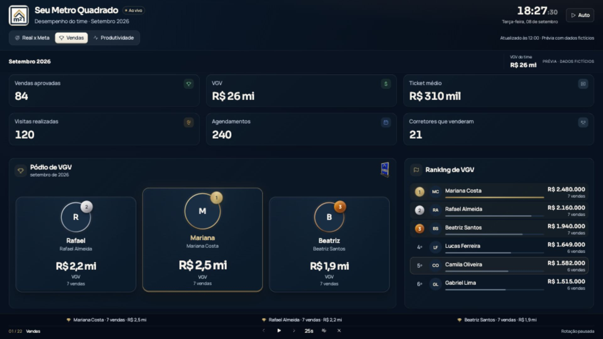

# Ranking SMQ — refinamento Arena Aurum

A página `/ranking` preserva a composição familiar do CRM: **Real x Meta, Vendas e Produtividade**, indicadores em cards, fotos circulares, pódio ao lado da classificação e tabelas detalhadas abaixo. O acabamento acrescenta molduras metálicas, relevo em CSS, luz discreta no líder e transições, com a logo e o troféu da empresa. A tipografia acompanha o painel existente: Manrope e Sora.

## Prévia e integração

```sh
npm ci
npx vite --config e2e/ranking-preview/vite.config.ts
```

Abra `http://127.0.0.1:4180/?sem-fullscreen`. A prévia usa **30 personagens fictícios**, sem autenticação ou acesso ao CRM. Os controles amarelos permitem simular falha, carregamento, falta de vendas/metas, empate de 30, nova aprovação e cenários adicionais. As imagens com dados reais fornecidas como referência não fazem parte dos arquivos publicados.

A rota integrada requer a migration `supabase/migrations/20260911100000_ranking_campeonato.sql`. Ela foi renumerada de `20260908202701`: o número original era anterior ao das migrations já aplicadas no remoto (`20260909100000`/`20260910100000`), o runner do Supabase recusa migration fora de ordem e por isso ela nunca rodou — a função `ranking_campeonato` não existia e a página caía em PGRST202. Reaplicar é seguro (`CREATE OR REPLACE` mais GRANT/REVOKE/COMMENT, sem tocar em dados). Enquanto a migration não roda no ambiente, a tela agora diz exatamente isso em vez de sugerir problema de conexão.

O modo TV entra na aba escolhida e intercala resumos e páginas de detalhes. O ciclo padrão contém 22 telas para 30 corretores e três gestores. Anterior, próxima, pausa, intervalos de 15/25/40/60 segundos, áudio e saída ficam acessíveis. Setas, espaço e Escape também funcionam. A rotação pausa com a aba oculta e durante celebrações; uma atualização normal mantém a posição. A sobreposição funciona quando a Fullscreen API é recusada.

## Apresentação

- **Real x Meta:** barra principal, anel de atingimento, indicadores, vendedores, VGV contra meta e resultado individual.
- **Vendas:** seis indicadores, pódio com retratos circulares, ranking de VGV, conversão da carteira, tabela completa e gestores em classificação separada.
- **Produtividade:** oito indicadores, pesos vigentes, pódio por pontos, ranking, composição e tabela com as seis atividades.
- **Celular:** cards em duas colunas, pódio compacto e detalhes verticais com todos os campos. O contexto permanece acessível ao rolar.
- **Identidade:** marinho, dourado, prata e bronze; molduras com relevo, reflexo discreto e tilt de até 6° no ponteiro. O troféu real assina o cabeçalho do pódio e as celebrações.

Os materiais ficam estáticos com movimento reduzido. Tilt e reordenação usam `transform`/`opacity`, `will-change` temporário e animações nativas. O brilho contínuo é reservado ao líder e desligado em empates. Celebrações usam até 18 partículas. Áudio começa desligado. Nenhuma dependência nova foi adicionada.

## Regras e integridade dos dados

O RPC anterior limitava a consulta a 50 pessoas ordenadas por pontos, podendo excluir alguém com VGV maior. A nova consulta retorna um JSON escalar com todos os participantes e a contagem esperada; o cliente rejeita contagens inconsistentes e IDs duplicados. Não há corte antes da classificação.

VGV e vendas continuam vindo de `atividades_diarias`, alimentada pelo ledger de aprovação. Aprovações pertencem ao dia de `aprovado_em` em São Paulo; o distrato desconta o dia original. Triggers e controles de aprovação não foram alterados. A consulta respeita os escopos operação, equipe e individual.

A classificação comercial usa VGV e desempata por vendas. Empates completos compartilham posição; nomes e IDs apenas estabilizam a apresentação. Quem não vendeu permanece na tabela com “—”. O pódio pagina empates extensos. Gestores somam cada equipe atual uma única vez, em classificação separada. Um perfil individual recebe seu resultado sem uma posição global inferida.

Metas respeitam a hierarquia central do CRM, sem somar níveis. A projeção linear do mês atual exige três dias úteis, três vendas e calendário carregado; antes disso informa “Aguardando base”. Pesos e pontuação histórica não foram alterados. Zero realizado é desenhado com barra zero.

Conversão usa os mesmos leads criados no mês, hoje atribuídos ao corretor, com venda aprovada atribuída a ele, respeitando o limite de confiabilidade cadastrado. Se a base não é válida, aparece “Conversão ainda não apurada”. Não se divide a quantidade de eventos independentes para inventar uma taxa.

Celebrações exigem uma aprovação nova identificada no ledger, recente e posterior à leitura anterior. Histórico, recarga inicial, cancelamento, troca de equipe e alteração isolada de meta não disparam efeitos. IDs vistos são persistidos por usuário e mês.

O ciclo de dados desta entrega é **mensal**. Filtros de dia, semana, trimestre e campanhas não são apresentados sem fonte correspondente. A comparação com o mês anterior e mudanças históricas de posição não estão disponíveis no snapshot atual; não são fabricadas. Fotografias ausentes usam iniciais.

## Arquivos principais

| Arquivo                                                     | Responsabilidade                                      |
| ----------------------------------------------------------- | ----------------------------------------------------- |
| `src/features/ranking/ranking-page.tsx`                     | Três abas, contexto, análise, TV, áudio e celebrações |
| `src/features/ranking/ranking-refined-views.tsx`            | Adapta o snapshot completo às visões familiares       |
| `src/features/ranking/ranking-refined.css`                  | Acabamento, escala para TV e responsividade           |
| `src/features/ranking/podium.tsx`                           | Retratos circulares, relevo, empates e interação      |
| `src/features/ranking/ranking-real-x-meta.tsx`              | Metas, projeção e indicadores                         |
| `src/features/ranking/ranking-vendas.tsx`                   | Vendas, pódio e tabela completa                       |
| `src/features/ranking/ranking-produtividade.tsx`            | Pontuação, pesos, composição e atividades             |
| `src/features/ranking/ranking-ui.tsx`                       | Medalhas, listas, relógio e gráficos compartilhados   |
| `src/features/ranking/ranking-campeonato.ts`                | Contrato, classificações, coortes e eventos           |
| `src/features/ranking/use-ranking-data.ts`                  | Consulta mensal atômica, polling e eventos            |
| `supabase/migrations/20260911100000_ranking_campeonato.sql` | Consulta completa dentro das permissões existentes    |

O histórico de criação do troféu e a procedência da logo estão em [ranking-trofeu-prompt.txt](../ranking-trofeu-prompt.txt). O troféu usa adaptação digital da fotografia; a logo mantém o desenho enviado, com compressão e enquadramento por CSS.

## Validação

- **39 testes focados passaram:** página, componentes das três visões, regras do ranking e hub de desempenho.
- TypeScript e build de produção passaram com Node 24 (`NODE_OPTIONS=--max-old-space-size=4096 npm run build`).
- Lint global de correção, formatação, TypeScript e orçamento de escapes de tipo passaram (144/144, sem alterar o teto).
- Orçamento de bundles passou. O chunk cliente do ranking tem aproximadamente **27,4 KB gzip**, abaixo do teto solicitado de 80 KB; CSS aproximadamente 11,8 KB gzip.
- **22 telas verificadas em 1920 × 1080 e 3840 × 2160**, após as animações, sem excesso na área da cena; 30 corretores e três gestores alcançados. Relatórios: [Full HD](refinado-auditoria-tv.json) e [4K](refinado-auditoria-4k.json).
- Largura de 390px sem rolagem horizontal; análise individual, retorno ao pódio e todos os campos de produtividade conferidos no navegador.
- Suíte geral: **1.636 testes passaram**, incluindo quatro novos casos para o contrato de memória do SamiQ.

Para resolver os bloqueios globais encontrados no CI, o timer da autenticação de prévia usa `const` e as chamadas de memória do SamiQ usam os tipos do schema, com IDs obrigatórios enviados como `null` quando ausentes. A consulta mantém os filtros de usuário/canal e o fallback de assinatura WhatsApp. Os testes de banco foram alinhados às migrations já presentes na base: unicidade global de telefone ativo e retorno separado de SDR/corretores na distribuição. A resolução de `js-yaml` foi atualizada de 4.3.1 para 4.3.2 para corrigir a vulnerabilidade alta apontada na auditoria. As regras do banco e os limites do CI não foram afrouxados.

A migration também foi executada em PGlite com schema representativo e 63 perfis: ausência de corte top-50, permissões de operação/equipe/indivíduo, conta inativa, mês inválido, coorte e estorno. O replay completo das migrations e triggers também foi executado no harness PostgreSQL do GitHub Actions; os quatro testes de banco do ranking passaram. A suíte completa de banco, o build, a auditoria de dependências, a varredura de segredos e o smoke do artefato de produção são gates do CI. Os resultados por commit estão no [PR #181](https://github.com/guinunes291/seumetroquadrado-crm/pull/181).

Ainda falta conferir a integração autenticada após a migration no ambiente de revisão, a leitura a três metros em uma TV física e o desempenho em um iPhone intermediário. As verificações de viewport não são medições de FPS em aparelhos físicos.

## Capturas da versão refinada

Todas contêm dados fictícios identificados na prévia.



| Visão                      | Captura                                                       |
| -------------------------- | ------------------------------------------------------------- |
| Real x Meta                | [Full HD](screenshots/refinado-tv-metas-1920.png)             |
| Produtividade              | [Full HD](screenshots/refinado-tv-produtividade-1920.png)     |
| Vendas em 4K               | [3840 × 2160](screenshots/refinado-tv-vendas-3840.png)        |
| Produtividade em 4K        | [3840 × 2160](screenshots/refinado-tv-produtividade-3840.png) |
| Pódio e ranking no celular | [390px](screenshots/refinado-mobile-podio.png)                |
| Indicadores no celular     | [390px](screenshots/refinado-mobile-produtividade.png)        |

Revisão: [PR #181](https://github.com/guinunes291/seumetroquadrado-crm/pull/181), branch `codex/ranking-campeonato-tv`. Implantação e aplicação da migration em produção são etapas separadas do merge.
