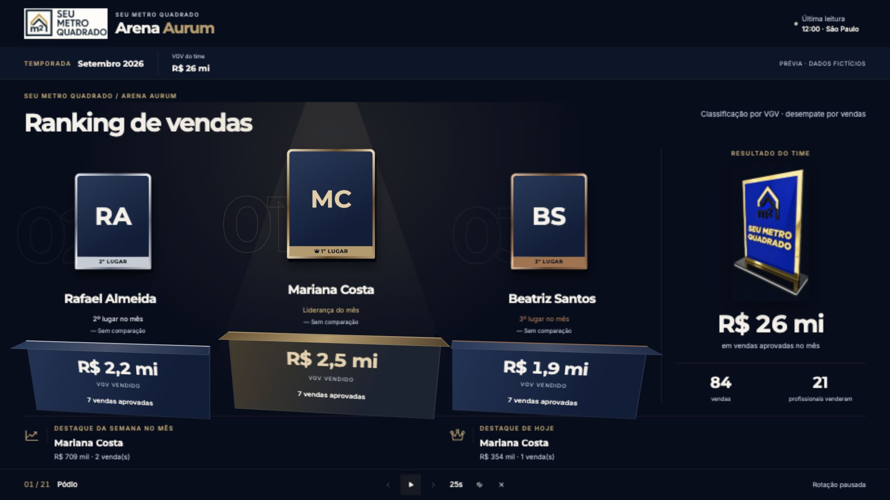

# Arena Aurum — revisão do ranking SMQ

A página `/ranking` recebe uma experiência de campeonato com VGV como critério principal, vendas como desempate, pódio em CSS 3D, identidade Aurum e rotação para a TV. A logo enviada pelo usuário e uma adaptação digital do troféu da empresa substituem os elementos provisórios.

## Abrir e testar

Prévia isolada, com **30 personagens fictícios** e sem acesso ao CRM:

```sh
npm ci
npx vite --config e2e/ranking-preview/vite.config.ts
```

Abra `http://127.0.0.1:4180/`. `?sem-fullscreen` simula um navegador que recusa a Fullscreen API; o modo de tela inteira por sobreposição continua funcionando. Os controles amarelos simulam carregamento, falha, ausência de vendas/metas, 30 empates e aprovação nova.

Na aplicação integrada, aplique primeiro a migration `20260908202701_ranking_campeonato.sql` no ambiente de revisão, execute `npm run dev` e entre em `/ranking` com a autenticação normal. A nova RPC é necessária. Nenhuma migration foi aplicada em produção nesta entrega.

O Modo TV começa em 25 segundos por tela. Controles: anterior, pausar/retomar, próxima, intervalo (15/25/40/60s), áudio e sair. Teclas: setas, espaço e Escape. A rotação pausa com a aba oculta ou durante celebrações e mantém a posição durante atualizações normais.

## Arquivos completos

- `src/features/ranking/ranking-page.tsx`: integração das visões, contexto fixo, análise, fullscreen, rotação, atualização e áudio.
- `src/features/ranking/campeonato-views.tsx`: pódio, posições, gestores, metas, seis atividades e análise individual.
- `src/features/ranking/ranking-campeonato.css`: identidade, Montserrat/Inter, materiais, faces 3D, responsividade e movimento reduzido.
- `src/features/ranking/aurum-motion.ts`: tilt de até 6°, reflexo no ponteiro e reordenação FLIP nativa.
- `src/features/ranking/ranking-campeonato.ts`: contrato validado, posições, empates, gestores, destaques, coortes e eventos novos.
- `src/features/ranking/ranking-derive.ts`: desempate comercial usa apenas VGV e vendas; nome/ID só estabilizam a apresentação.
- `src/features/ranking/use-ranking-data.ts`: snapshot mensal atômico, polling, invalidação por eventos e virada de data em São Paulo.
- `src/integrations/supabase/types.ts`: contrato da nova RPC.
- `supabase/migrations/20260908202701_ranking_campeonato.sql`: consulta completa dentro das permissões existentes.
- `tests/ranking-campeonato.test.ts`, `tests/ranking-page.test.tsx`, `tests/desempenho-hub.test.ts`: verificações de regras e interações.
- `tests/db/ranking-campeonato.test.ts`: integração para o harness PostgreSQL existente, com mais de 50 profissionais e aprovação/estorno.
- `tests/fixtures/ranking.ts` e `e2e/ranking-preview/`: dados e servidor de demonstração separados da rota autenticada.
- `public/images/ranking/`: logo original otimizada e troféu adaptado da fotografia enviada.
- `public/fonts/aurum/`: Montserrat e Inter, com licenças OFL.

## Decisões comerciais e dados

O RPC anterior limitava a consulta a 50 pessoas ordenadas por pontos, o que podia excluir alguém com VGV maior. O novo RPC retorna um JSON escalar com todos os participantes e a contagem esperada; o cliente rejeita contagem inconsistente e IDs duplicados. Não há top-N antes da classificação.

A fonte do VGV e das vendas continua sendo `atividades_diarias`, alimentada pelo ledger de aprovação. Aprovações pertencem ao dia de `aprovado_em` em São Paulo; o distrato desconta o dia original. Os controles e triggers de aprovação não foram alterados. Os gestores são classificados separadamente, somando uma única vez cada equipe atual vinculada a eles. Vínculos históricos não são inventados.

Empates em VGV e vendas compartilham a posição. Pessoas sem vendas aparecem com “—”. Todos continuam na classificação. Um empate com muitos participantes também pagina o pódio no computador. Uma conta de escopo individual recebe seu resultado, sem uma posição global inferida.

Metas respeitam a hierarquia central do CRM, sem somar níveis. A projeção é uma estimativa linear explícita, disponível somente no mês atual, após três dias úteis e três vendas e com calendário carregado. Os pesos das seis atividades e a pontuação histórica não foram alterados.

Conversão significa a proporção dos mesmos leads criados no mês, ainda atribuídos ao corretor na leitura, com venda aprovada atribuída a ele. É uma coorte dinâmica da carteira atual, com o limite de confiabilidade configurado no CRM. Se a base não é válida, aparece “Conversão ainda não apurada”. Eventos independentes não são divididos entre si.

Celebrações exigem aprovação nova identificada pelo ledger, posterior à leitura anterior e recente. A primeira leitura estabelece a base; histórico, troca de equipe, cancelamento e alteração isolada de meta não disparam efeitos. Os IDs vistos são persistidos por usuário/mês. A mudança de posição pode entrar no reconhecimento de uma aprovação verificada. O áudio começa desligado e só é criado/resumido por interação explícita.

## Dados ainda indisponíveis

- Comparação histórica de posições: mostra “Sem comparação”; não inventa setas ou deltas.
- Campanhas e trimestre: o ciclo implementado continua mensal. Não há filtros sem fonte correspondente.
- Fotos ausentes: iniciais. A integração usa `avatar_url`/`foto_url` reais; nenhuma foto fictícia foi atribuída a um profissional real.
- Classificação global de perfis individuais: não é deduzida de dados fora da permissão.

## Movimento e desempenho

Nenhuma dependência de JavaScript foi acrescentada. CSS 3D e Web Animations atendem à cena sem WebGL. Os números completos ficam disponíveis imediatamente; entrada e reordenação animam a apresentação sem contar lentamente até o resultado. Duas famílias de movimento contínuo no pódio: flutuação discreta do líder e reflexo metálico. Empates desligam o movimento de destaque para não favorecer um participante tecnicamente ordenado antes dos outros.

Tilt e FLIP animam somente `transform` e `opacity`. `will-change` é temporário. Há uma superfície com `backdrop-filter`, desativada na TV. Celebrações usam 18 partículas por vez. Aba oculta pausa os efeitos; `prefers-reduced-motion` desliga tilt, FLIP, partículas e movimento contínuo, mantendo os materiais estáticos.

A logo é WebP de cerca de 38 KB e o troféu cerca de 59 KB; as duas fontes locais somam cerca de 86 KB. O chunk de JavaScript do ranking fica abaixo de 19 KB gzip, com limite solicitado de 80 KB, fora das bibliotecas já existentes.

## Checklist para revisão antes de publicar

- [x] 30 corretores percorrem as 21 telas da rotação padrão, incluindo quem está zerado.
- [x] Cinco visões verificadas em 1920 × 1080 e 3840 × 2160, sem rolagem na área da cena.
- [x] Layout de 390px sem rolagem horizontal; produtividade reorganiza as seis atividades verticalmente.
- [x] Nome longo e análise comercial verificados no celular; faixa de contexto permanece fixa ao rolar.
- [x] Metas, pesos, empates, snapshots incompletos e eventos repetidos cobertos nos testes.
- [x] Tela inteira funciona também quando a Fullscreen API é recusada; entrada, saída e controles testados.
- [x] Identidade usa as cores solicitadas e as fontes Montserrat/Inter locais.
- [ ] Executar o harness PostgreSQL completo num ambiente com Docker/PostgreSQL antes de aplicar a migration.
- [ ] Confirmar leitura a três metros na TV física e fluidez num iPhone intermediário. A validação aqui usou viewport em navegador; não afirma medições de 60fps no aparelho.
- [ ] Conferir a experiência autenticada no ambiente de revisão após aplicar a migration, com os perfis reais autorizados.

## Verificações automatizadas

31 testes focados passaram. A suíte geral passou em 1.631 testes e falhou em um teste preexistente de SamiQ (`tests/samiq-governance.test.ts:289`). O teste espera uma RPC ausente também em `origin/main`; os arquivos de SamiQ não foram modificados.

O lint global tem um erro preexistente `prefer-const` em `src/integrations/supabase/previewAuthStorage.ts:38`. O orçamento global de escapes de tipo já é 147 em `origin/main`, contra o teto de 144; a implementação não adiciona esses escapes. As verificações específicas dos arquivos alterados são executadas separadamente.

A migration foi executada adicionalmente em PGlite com schema representativo: 63 perfis, ausência de corte top-50, escopos operação/equipe/individual, conta inativa, rejeição de mês inválido, coorte e estorno. Isso verifica a nova consulta, mas não substitui o replay de todas as migrations e triggers do harness PostgreSQL.

TypeScript (`npm run typecheck`), lint dos arquivos alterados, build de produção com Node 24 (`NODE_OPTIONS=--max-old-space-size=4096 npm run build`), formatação e orçamento de bundles passaram. Nenhum deploy foi feito. A branch é `codex/ranking-campeonato-tv`.

Contraste dos pares de texto usados: creme sobre azul elevado 12,81:1; apoio sobre azul elevado 7,06:1; dourado sobre azul elevado 5,35:1; bronze sobre fundo profundo 4,73:1; legenda escura sobre dourado 7,16:1. A inspeção de foco e materiais complementa essas relações de cores sólidas.

O histórico de criação do troféu, com os prompts completos e a procedência da logo, está em [ranking-trofeu-prompt.txt](../ranking-trofeu-prompt.txt). O troféu usa uma adaptação digital da foto; a logo mantém o desenho enviado, com compressão e enquadramento por CSS.

## Capturas renderizadas

Todas as capturas usam **dados fictícios identificados na prévia**. Os relatórios [Full HD](aurum-auditoria-tv.json) e [4K](aurum-auditoria-4k.json) registram as medidas da área de cena e a cobertura da rotação.



| Visão                                           | Captura                                                |
| ----------------------------------------------- | ------------------------------------------------------ |
| Corretores, incluindo zerados durante a rotação | [Full HD](screenshots/aurum-tv-classificacao-1920.png) |
| Gestores                                        | [Full HD](screenshots/aurum-tv-gestores-1920.png)      |
| Realizado × meta                                | [Full HD](screenshots/aurum-tv-metas-1920.png)         |
| Seis atividades de produtividade                | [Full HD](screenshots/aurum-tv-produtividade-1920.png) |
| Pódio 4K                                        | [3840 × 2160](screenshots/aurum-tv-podio-3840.png)     |
| Celular                                         | [390px](screenshots/aurum-mobile-390.png)              |
| Análise com nome longo                          | [Celular](screenshots/aurum-analise-mobile.png)        |
| Contexto fixo durante a rolagem                 | [Celular](screenshots/aurum-classificacao-mobile.png)  |

## Estados para conferir

Na prévia, use os botões amarelos e o seletor “Cenários adicionais”. “Restaurar” retorna ao cenário inicial.

| Estado               | Comportamento                                                                  | Captura                                               |
| -------------------- | ------------------------------------------------------------------------------ | ----------------------------------------------------- |
| Carregando           | Skeleton com três posições e líder mais alto; texto acessível de carregamento. | [Abrir](screenshots/aurum-mobile-carregando.png)      |
| Nenhum participante  | Mensagem sobre o escopo sem inventar competidores.                             | [Abrir](screenshots/aurum-mobile-vazio.png)           |
| Sem vendas ou metas  | Pódio em aberto, lista completa com “—” e métricas zeradas.                    | [Abrir](screenshots/aurum-mobile-sem-vendas.png)      |
| Um vendedor          | Primeiro lugar central; as outras posições ficam vagas.                        | [Abrir](screenshots/aurum-mobile-um-vendedor.png)     |
| Dois vendedores      | Primeiro ao centro e segundo à esquerda, preservando a posição física.         | [Abrir](screenshots/aurum-mobile-dois-vendedores.png) |
| 30 empatados         | Posição compartilhada, alturas iguais e paginação para todos.                  | [Abrir](screenshots/aurum-mobile-empate.png)          |
| Primeiro dia         | Realizado zerado e projeção aguardando base mínima.                            | [Abrir](screenshots/aurum-mobile-primeiro-dia.png)    |
| Nova aprovação       | Celebração breve com o troféu SMQ; áudio desligado inicialmente.               | [Abrir](screenshots/aurum-mobile-celebracao.png)      |
| Falha de atualização | Último snapshot continua visível, com aviso e botão para tentar novamente.     | Controle “Simular falha”                              |
| Sem foto             | Iniciais na moldura metálica; a foto real é usada quando disponível.           | Todas as capturas da prévia                           |

Antes de publicar, ainda devem ser conferidos os itens não marcados no checklist acima. A integração final depende da aplicação da nova migration no ambiente de revisão.
